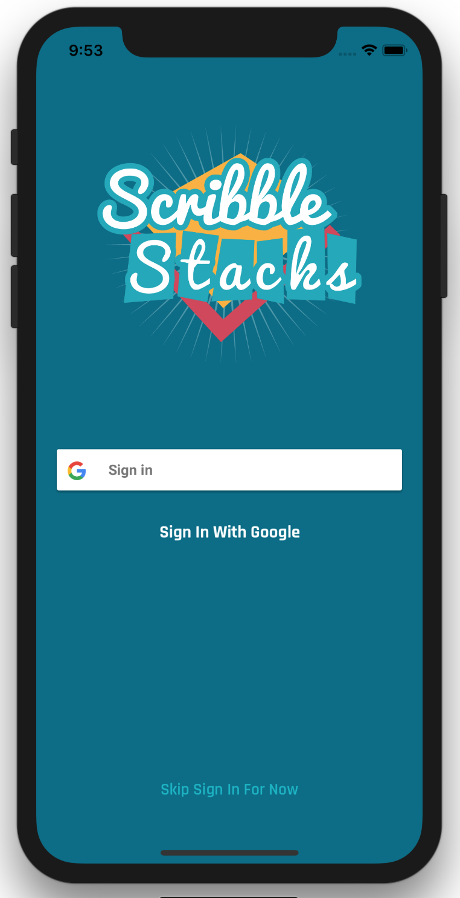
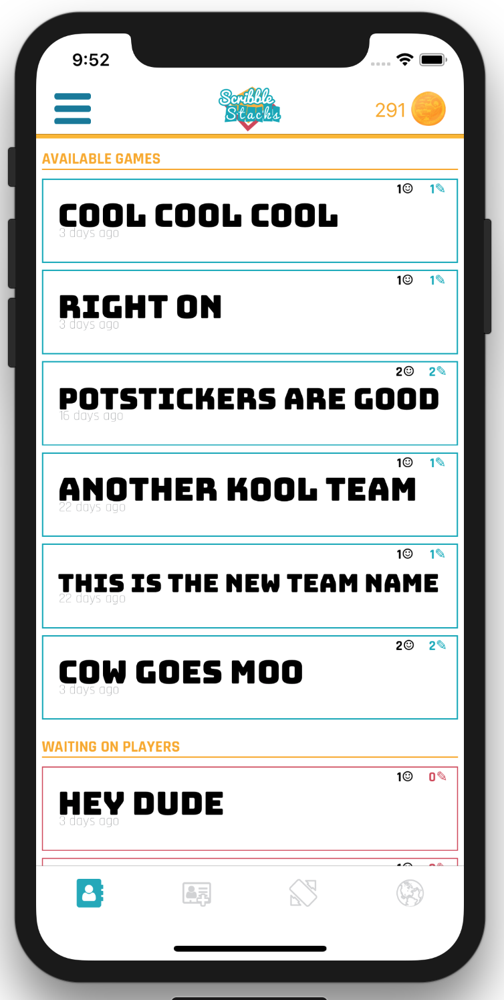
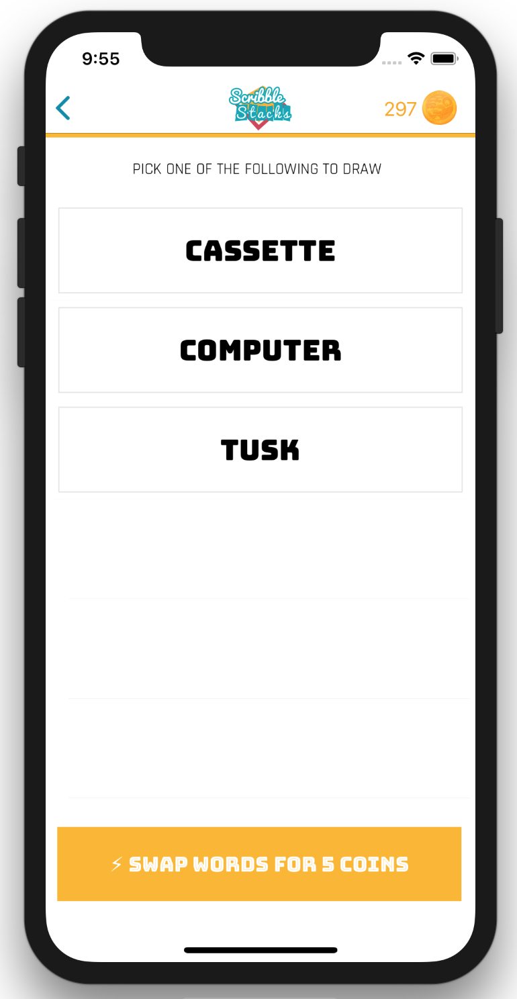
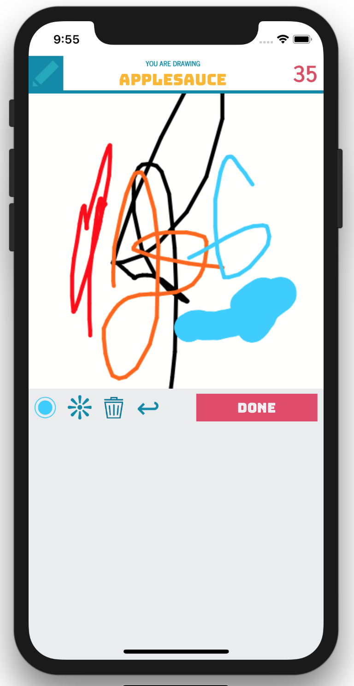
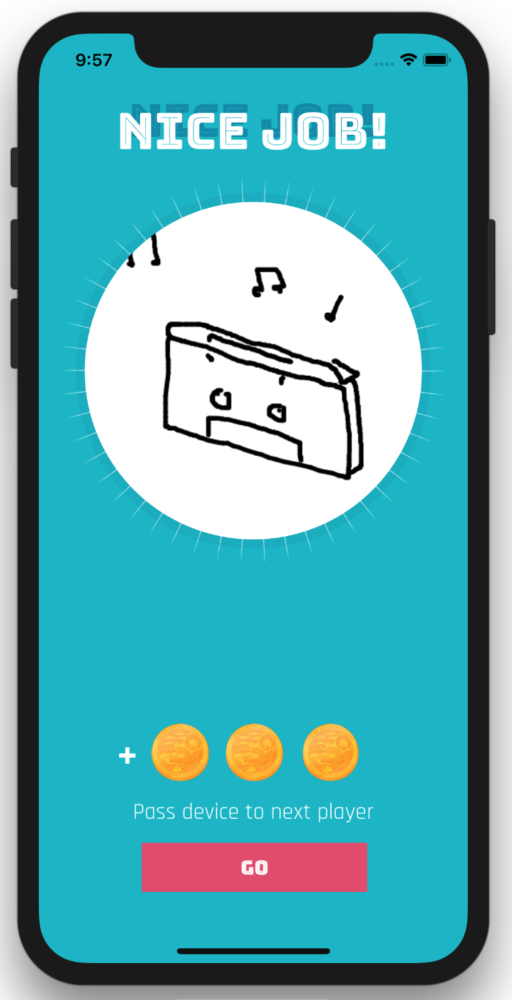
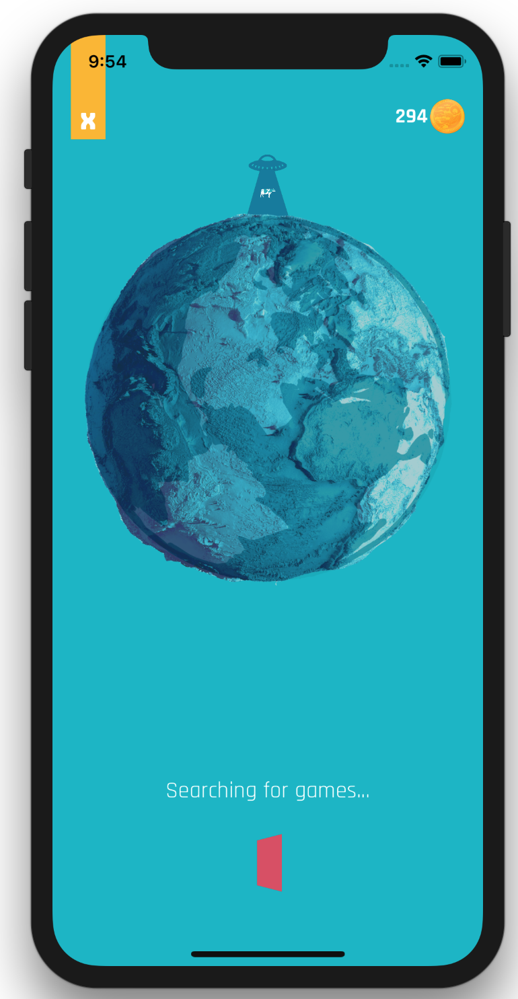
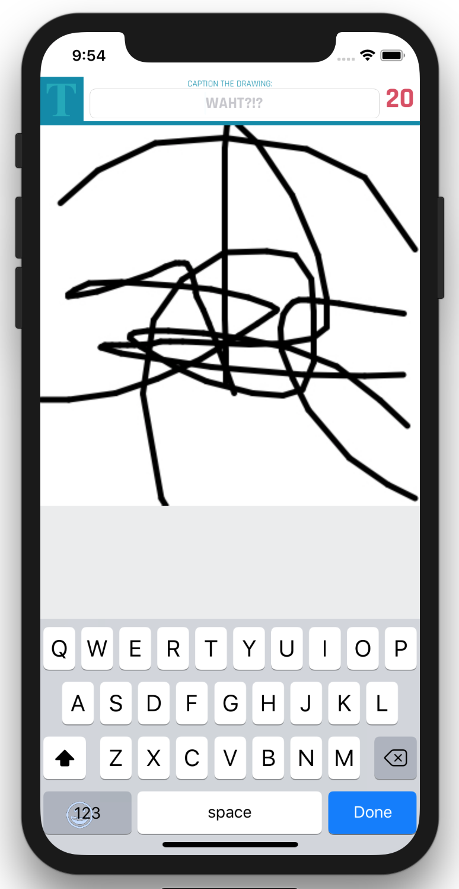
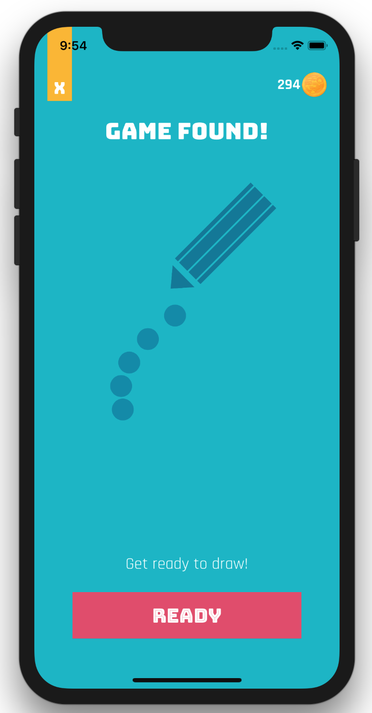
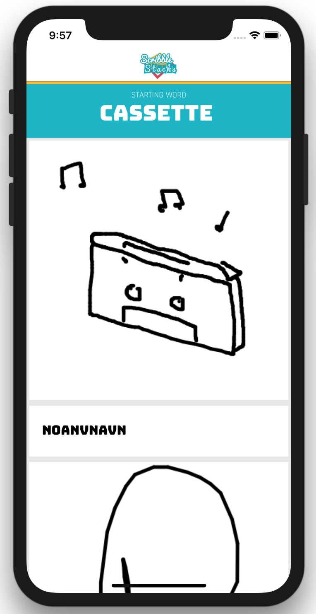
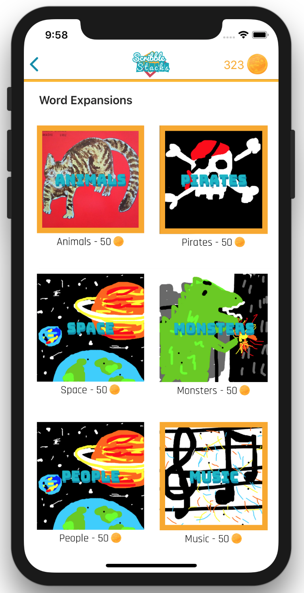

# ScribbleStacks
Scribble Stacks is essentially Pictionary mixed with telephone. The core gameplay mechanics consist of drawing words and creating captions for your friends drawings, and the fun comes from seeing how the final drawing has evolved from the original. The key component and source of fun is the idea of group play.

Unlike games like 'Draw Something' or the 'with Friends' series which are usually 1-on-1 game, Scribble Stacks allows friends to play together with as large of a group as they want. Adding friends is easy and makes use of Google Invites, sending dynamic links through sms text messages or email. All user, team, and game data is stored in a Firebase non-relational database.

I've also included a currency system and shop to allow user expand the available words they can draw with themed word packs. I made the shop flexible so that when word lists are remotely be added to the database, the shop is reflected as well without requiring users to update the app.

Games modes include Team Play, Local Pass-n-Play, and Public Games. Available across all ios devices, iPhone 5 - iPhone X and iPad, iOS9 and later.

